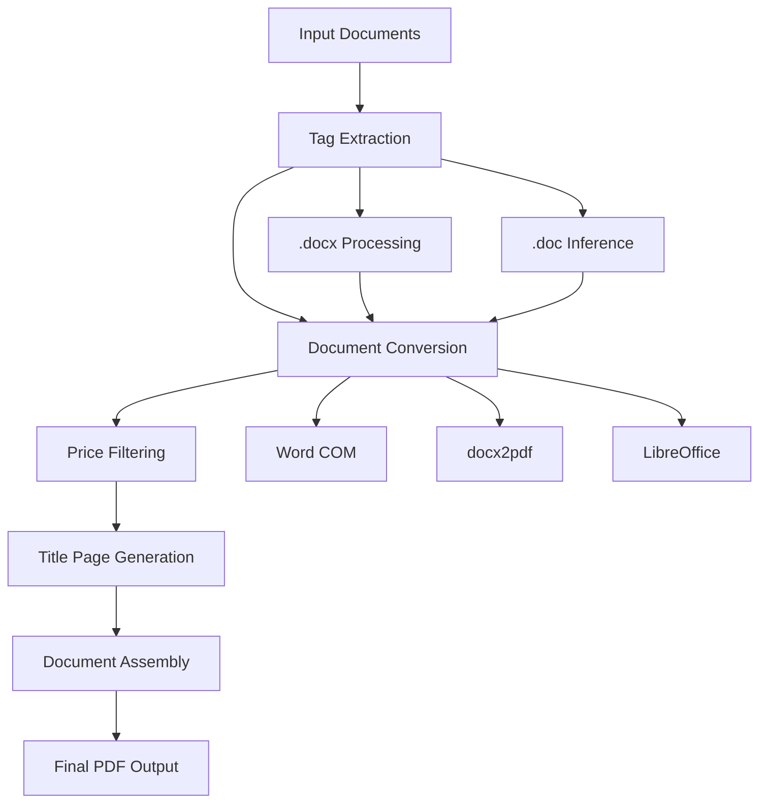

# DST Submittals Generator

A comprehensive Python tool for generating professional HVAC submittal documents from .doc/.docx files with intelligent tag extraction, document ordering, and PDF compilation.

## 🚀 Features

- **Multi-Format Support**: Handles both .doc and .docx files seamlessly
- **Intelligent Tag Extraction**: Automatically identifies equipment tags from document content
- **Document Ordering**: Orders documents per tag as Technical Data Sheet → Fan Curve → Drawing
- **Price Filtering**: Automatically excludes pages containing pricing information
- **Professional Title Pages**: Creates centered, bold title pages for each equipment tag
- **Cut Sheets Integration**: Dedicated section for CS*.pdf files
- **High-Quality Conversion**: Uses Microsoft Word COM automation for optimal PDF quality
- **Batch Processing**: Processes entire directories of documents efficiently

## 📋 Requirements

### System Requirements
- Windows OS (required for Microsoft Word COM automation)
- Microsoft Word installed (2010 or later)
- Python 3.7 or higher

### Python Dependencies
```bash
pip install -r requirements.txt
```

**Core Dependencies:**
- `python-docx>=0.8.11` - DOCX file processing
- `pypdf>=3.0.0` - PDF manipulation and merging
- `docx2pdf>=0.1.8` - Document conversion fallback
- `reportlab>=4.0.0` - Professional title page generation  
- `pywin32>=306` - Windows COM automation for Word

## 🛠️ Installation

1. **Clone the repository:**
```bash
git clone https://github.com/yourusername/dst-submittals-generator.git
cd dst-submittals-generator
```

2. **Install dependencies:**
```bash
pip install -r requirements.txt
```

3. **Ensure Microsoft Word is installed** on your system for optimal document conversion.

## 📖 Usage

### Basic Usage

1. **Prepare your documents:**
   - Place .doc/.docx files in a folder
   - Include any CS*.pdf cut sheet files in the same folder
   - Ensure documents follow standard naming conventions

2. **Extract tags and generate PDF:**
```python
from src.tag_extractor import TagExtractor
from src.high_quality_pdf_converter import DocumentPDFConverter
from src.create_final_pdf import FinalPDFAssembler

# Extract tags from documents
extractor = TagExtractor(r"path\to\your\documents")
tag_mapping = extractor.extract_all_tags()

# Convert documents to PDF
converter = DocumentPDFConverter(r"path\to\your\documents")
pdf_mapping = converter.convert_all_documents(tag_mapping)

# Create final organized PDF
assembler = FinalPDFAssembler(r"path\to\your\documents")
final_pdf = assembler.create_final_pdf()
```

### Advanced Usage

#### Custom Document Processing
```python
from src.high_quality_pdf_converter import DocumentPDFConverter

# Initialize converter with custom output directory
converter = DocumentPDFConverter(
    docs_path=r"C:\Documents\HVAC_Submittals",
    output_dir="custom_pdfs"
)

# Convert with detailed logging
pdf_mapping = converter.convert_all_documents(tag_mapping)
converter.print_conversion_summary()
```

#### Title Page Customization
```python
from src.title_page_generator import TitlePageGenerator

# Generate custom title pages
generator = TitlePageGenerator(output_dir="custom_titles")
title_pages = generator.create_all_title_pages(['AHU-1', 'AHU-2', 'MAU-12'])
```

## 📁 Project Structure

```
dst-submittals-generator/
├── src/
│   ├── tag_extractor.py              # Tag extraction from documents
│   ├── enhanced_doc_extractor.py     # Enhanced .doc file processing
│   ├── high_quality_pdf_converter.py # Document to PDF conversion
│   ├── title_page_generator.py       # Professional title page creation
│   ├── create_final_pdf.py          # Final PDF assembly
│   └── update_pdf_mapping.py        # PDF mapping utilities
├── tests/
│   └── test_word_com.py             # COM automation tests
├── docs/                            # Documentation
├── examples/                        # Usage examples
├── requirements.txt                 # Python dependencies
├── LICENSE                         # Open source license
├── .gitignore                      # Git ignore patterns
└── README.md                       # This file
```

## 🔧 Core Components

### 1. Tag Extraction (`tag_extractor.py`)
- Extracts equipment tags from document content using regex patterns
- Handles various tag formats (AHU-1, MAU-12, etc.)
- Creates intelligent filename mappings for .doc files

### 2. PDF Conversion (`high_quality_pdf_converter.py`)
- **Primary Method**: Microsoft Word COM automation for highest quality
- **Fallback Methods**: docx2pdf and LibreOffice support
- **Smart Filtering**: Removes pages containing pricing information
- **Batch Processing**: Handles large document collections efficiently

### 3. Document Assembly (`create_final_pdf.py`)
- **Tag Ordering**: MAU tags first, then AHU tags numerically
- **Document Sequence**: Technical Data Sheet → Fan Curve → Drawing per tag
- **Professional Layout**: Title pages with centered, bold equipment tags
- **Cut Sheets Section**: Dedicated area for all CS*.pdf files

### 4. Title Generation (`title_page_generator.py`)
- **Professional Design**: 48pt Helvetica-Bold, centered layout
- **Consistent Formatting**: 3.5 inch top margin for visual balance
- **Batch Creation**: Generates titles for all equipment tags automatically

## 📊 Document Processing Flow



## 🎯 Tag Detection Patterns

The system recognizes various equipment tag formats:

- **AHU Tags**: `AHU-1`, `AHU-10`, `AHU-E1`
- **MAU Tags**: `MAU-12`, `MAU-01`
- **Unit Tags**: `Unit Tag: AHU-5`
- **Equipment ID**: `Equipment ID: MAU-12`

## 🚨 Error Handling

The tool includes comprehensive error handling:

- **File Access Errors**: Graceful handling of locked or missing files
- **Conversion Failures**: Multiple fallback conversion methods
- **COM Automation**: Automatic Word application cleanup
- **PDF Processing**: Robust page filtering and assembly

## 💡 Tips for Best Results

1. **Document Naming**: Use consistent filename patterns (e.g., `10_Technical Data Sheet.docx`)
2. **Tag Placement**: Include equipment tags in document headers or prominent locations
3. **File Organization**: Keep all related documents in a single directory
4. **Word Installation**: Ensure Word is properly installed for optimal conversion quality
5. **Pricing Content**: The system automatically excludes pages with "$" symbols

## 🐛 Troubleshooting

### Common Issues

**Word COM Errors:**
```python
# Test Word automation
from tests.test_word_com import test_word_com_single_file
success = test_word_com_single_file()
```

**Missing Dependencies:**
```bash
pip install --upgrade -r requirements.txt
```

**File Access Issues:**
- Ensure Word documents are not open in other applications
- Run with appropriate file permissions
- Check for network drive access if applicable

## 📈 Performance

- **Conversion Speed**: ~2-5 seconds per document (Word COM)
- **Memory Usage**: Efficiently processes large document collections
- **File Size**: Maintains original document quality and formatting
- **Scalability**: Tested with 50+ document collections

## 🤝 Contributing

1. Fork the repository
2. Create a feature branch (`git checkout -b feature/amazing-feature`)
3. Commit your changes (`git commit -m 'Add amazing feature'`)
4. Push to the branch (`git push origin feature/amazing-feature`)
5. Open a Pull Request

## 📝 License

This project is licensed under the MIT License - see the [LICENSE](LICENSE) file for details.

## 🆘 Support

For support and questions:
- Open an issue on GitHub
- Check the documentation in the `docs/` directory
- Review example usage in the `examples/` directory

## 🎉 Acknowledgments

- Built with Microsoft Word COM automation for professional-quality output
- Utilizes ReportLab for beautiful title page generation
- Powered by python-docx for reliable document processing

---

**DST Submittals Generator** - Streamlining HVAC submittal document creation with intelligent automation.